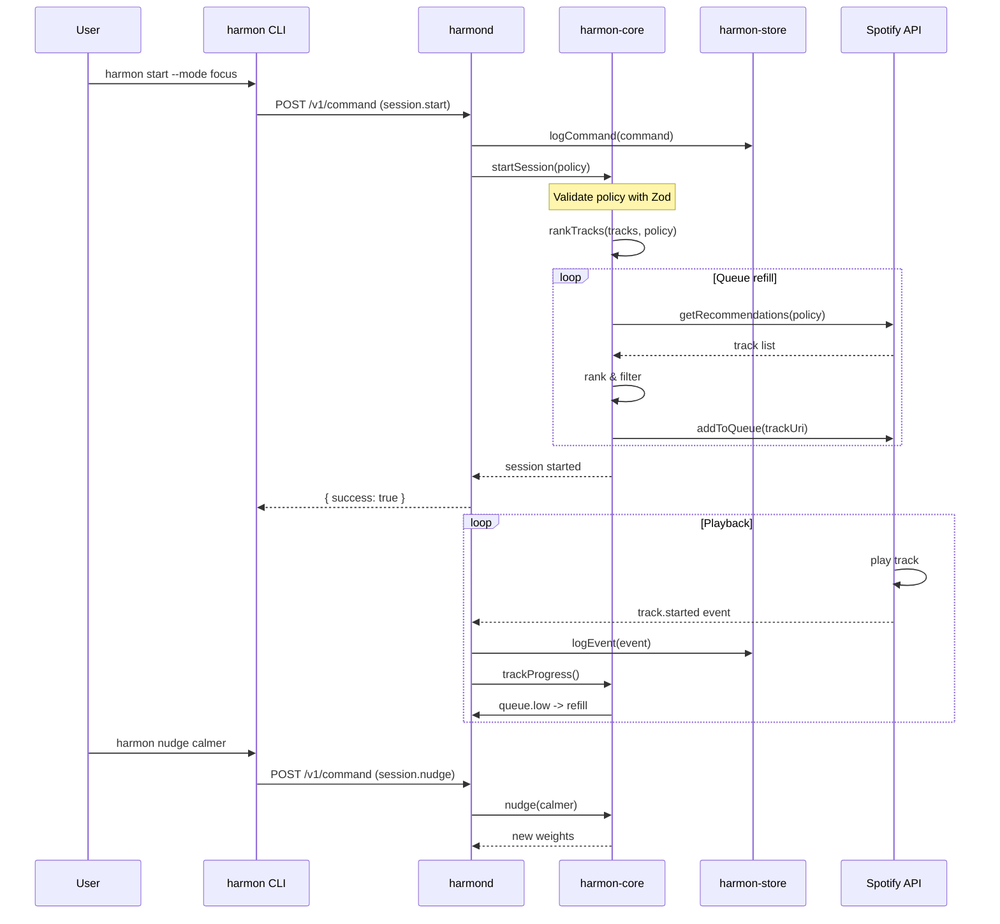

# Harmon Architecture

Policy-driven music session manager with daemon-first architecture.

## System Overview

```
┌─────────────────────────────────────────────────────────────────────┐
│                         Harmon System                                │
├─────────────────────────────────────────────────────────────────────┤
│                                                                      │
│   ┌──────────┐     ┌──────────┐                                     │
│   │   WSL    │     │  macOS   │                                     │
│   │   CLI    │     │ Menubar  │                                     │
│   └────┬─────┘     └────┬─────┘                                     │
│        │                │                                           │
│        └───────┬────────┘                                           │
│                │                                                    │
│                ▼                                                    │
│   ┌─────────────────────────────┐                                   │
│   │    harmond (:17373)         │                                   │
│   │    Daemon + Engine          │                                   │
│   └──────────────┬──────────────┘                                   │
│                  │                                                   │
│    ┌─────────────┼─────────────┐                                   │
│    │             │             │                                   │
│    ▼             ▼             ▼                                   │
│ ┌──────┐    ┌─────────┐    ┌─────────┐                             │
│ │Store │    │  Core   │    │Spotify  │                             │
│ │ SQLite│    │ Engine  │    │  API    │                             │
│ └───┬───┘    └────┬────┘    └────┬────┘                             │
│     │             │              │                                  │
│     ▼             └──────────────┴──► Spotify Web API               │
│  .harmonic-flow/                                                │
│  (Markdown + SQLite)                                            │
│                                                                  │
└─────────────────────────────────────────────────────────────────────┘
```

**Key principle:** WSL and macOS clients are dumb terminals. Only `harmond` owns tokens + state + learning.

## Monorepo Structure

```
harmon/
├── apps/                          # Deployable applications
│   ├── harmon-cli/                # Thin CLI client → calls daemon via HTTP
│   │   ├── src/
│   │   │   └── index.ts           # CLI client logic
│   │   ├── bin/
│   │   │   └── harmon.js          # CLI entry point
│   │   └── package.json
│   │
│   ├── harmond/                   # Daemon: engine + store + spotify
│   │   ├── src/
│   │   │   └── index.ts           # Express server + routes
│   │   ├── bin/
│   │   │   └── harmond.js         # Daemon entry point
│   │   └── package.json
│   │
│   └── harmon-menubar/            # macOS client (Tauri) + voice
│       └── (future)
│
├── packages/                      # Shared libraries
│   ├── harmon-protocol/           # Command/Event/Policy types + Zod
│   │   ├── src/
│   │   │   └── index.ts           # All Zod schemas
│   │   └── package.json
│   │
│   ├── harmon-store/              # SQLite persistence layer
│   │   ├── src/
│   │   │   └── index.ts           # DB + migrations
│   │   └── package.json
│   │
│   ├── harmon-core/               # Session engine + ranking
│   │   ├── src/
│   │   │   └── index.ts           # State machine + policy ranking
│   │   └── package.json
│   │
│   ├── harmon-spotify/            # Spotify API + OAuth
│   │   ├── src/
│   │   │   └── index.ts           # API client + auth
│   │   └── package.json
│   │
│   └── harmon-voice/              # macOS STT + intent parsing
│       └── (future)
│
├── .claude/
│   └── agents/
│       └── harmon-developer.md    # Claude Code agent
│
├── package.json                   # Root workspace config
├── pnpm-workspace.yaml            # Workspace definition
├── tsconfig.base.json             # TypeScript base config
└── turbo.json                     # Turborepo pipeline
```

## Package Dependencies

```
                    ┌─────────────────┐
                    │ harmon-cli      │
                    └────────┬────────┘
                             │
                    ┌────────▼────────┐
                    │ harmon-protocol │
                    └────────┬────────┘
                             │
         ┌───────────────────┼───────────────────┐
         │                   │                   │
┌────────▼────────┐  ┌───────▼───────┐  ┌───────▼───────┐
│   harmon-core   │  │ harmon-store  │  │ harmon-spotify│
└─────────────────┘  └───────────────┘  └───────────────┘
```

## Naming Convention

| Package | Binary | Purpose |
|---------|--------|---------|
| `@athena/harmon` | `harmon` | User-facing CLI |
| `@athena/harmond` | `harmond` | Daemon (engine + store + spotify) |
| `@athena/harmon-protocol` | — | Command/Event types + Zod schemas |
| `@athena/harmon-core` | — | Session engine, ranking, adaptation |
| `@athena/harmon-store` | — | SQLite + migrations |
| `@athena/harmon-spotify` | — | Spotify API client + OAuth |
| `@athena/harmon-voice` | — | macOS STT + intent parsing |

## Data Flow



## Daemon API

**Endpoint:** `http://127.0.0.1:17373` (override: `HARMON_ENDPOINT`)

### REST Endpoints

| Method | Path | Description |
|--------|------|-------------|
| GET | `/health` | Health check |
| GET | `/v1/status` | Current session, device, track, queue depth |
| POST | `/v1/command` | Send commands (start, nudge, skip, etc.) |
| GET | `/v1/devices` | Spotify devices |
| POST | `/v1/device/use` | Transfer playback |
| POST | `/v1/auth/spotify/login` | Trigger PKCE login flow |
| POST | `/v1/auth/spotify/logout` | Clear tokens |

### SSE Stream

`GET /v1/events` - Emits events:
- `session.started` - Session began
- `session.stopped` - Session ended
- `session.nudged` - Session weights were adjusted
- `track.started` - New track playing
- `track.skipped` - Track was skipped
- `queue.refilled` - Queue was replenished
- `device.changed` - Playback target changed
- `spotify.connected` - Spotify auth successful
- `spotify.disconnected` - Spotify auth revoked
- `connected` - Initial SSE handshake event
- `heartbeat` - Keepalive ping
- `error` - Error occurred

### Envelope Shapes

**Command:**
```json
{
  "id": "c_01H...",
  "ts": 1760000000000,
  "source": { "kind": "cli|menubar|voice", "device": "macos|windows|wsl" },
  "type": "session.start",
  "payload": { "policy": { ... } }
}
```

**Event:**
```json
{
  "id": "e_01H...",
  "ts": 1760000000123,
  "type": "track.started",
  "payload": {
    "track": { "id": "...", "name": "...", "artist": "..." },
    "sessionId": "sess_xxx"
  }
}
```

## SessionPolicy Schema

The heart of the system. All preferences compile to this JSON.

```json
{
  "version": 1,
  "mode": "focus",
  "durationMs": 3000000,
  "device": { "preferActive": true, "deviceId": null },
  "queue": { "target": 12, "refillWhenBelow": 5 },
  "hard": {
    "noVocals": true,
    "explicit": "avoid",
    "tempo": { "min": 60, "max": 110 },
    "energy": { "min": 0.15, "max": 0.55 },
    "instrumentalnessMin": 0.70
  },
  "soft": {
    "weights": {
      "energy": 0.20,
      "instrumentalness": 0.35,
      "speechiness": -0.40,
      "valence": 0.05,
      "acousticness": 0.10,
      "tempo": 0.10,
      "recencyPenalty": 0.50
    },
    "arc": { "shape": "flat|ramp", "warmupMs": 300000, "cooldownMs": 300000 }
  },
  "sources": {
    "likedTracks": true,
    "topTracks": true,
    "recentPlays": true,
    "seedPlaylists": ["spotify:playlist:..."],
    "seedArtists": ["spotify:artist:..."],
    "discovery": { "enabled": true, "ratio": 0.15 }
  },
  "limits": {
    "repeatTrackWithinDays": 14,
    "repeatArtistWithinHours": 6
  },
  "dhyana": {
    "breath": { "cadence": "slow|medium|none" },
    "fadeInMs": 12000,
    "fadeOutMs": 12000,
    "volumeCeiling": 40
  }
}
```

**Key principle:** AI never directly queues tracks. It produces Policy JSON which is validated (Zod) → engine executes.

## User Choice Journal (`.harmonic-flow/`)

Dual-backing strategy:
- **Markdown files** - Human-readable audit trail, LLM context, version-control friendly
- **SQLite index** - Fast queries for auto-suggestions, pattern analysis

```
.harmonic-flow/
  2024-01-13T10-30-uuid.md   # raw journal entry
  2024-01-13T11-45-uuid.md
```

### Entry Shape

```markdown
---
ts: 2024-01-13T10:30:00Z
source: cli | menubar | voice
device: macos
sessionId: sess_xxx
policy: { "mode": "focus", "durationMs": 3600000, ... }
---

# Session Request

**Mood:** calm, tired
**Duration:** 60mins
**Explicit:** avoid
**Energy:** low
**Note:** need to focus on coding but feeling drained

---
*Auto-suggested based on similar sessions: 2024-01-11, 2024-01-08*
```

## Implementation Phases

1. **Phase 1: Foundation** - Monorepo + `harmon-protocol` with Zod schemas
2. **Phase 2: Core Daemon** - `harmon-store` + `harmond` with HTTP+SSE
3. **Phase 3: Spotify Integration** - OAuth + device control
4. **Phase 4: Session Engine** - State machine + policy ranking
5. **Phase 5: Flow & Journal** - Markdown journal + SQLite index
6. **Phase 6: Clients** - `harmon-cli` + menubar skeleton
7. **Phase 7: Voice** - macOS STT + intent→Policy mapping

## WSL Considerations

```
┌────────────────────────────────────────┐
│ Windows Host                           │
│                                        │
│  ┌────────────────────────────────┐    │
│  │ Spotify App                    │    │
│  └────────────────────────────────┘    │
│                                        │
│  localhost:17373 ◄─── (if accessible)  │
│                                        │
└────────────────────────────────────────┘
         │
    WSL2 network bridge
         │
┌────────────────────────────────────────┐
│ WSL2 Linux                             │
│                                        │
│  harmon (CLI) ──► harmond:17373        │
│                                        │
│  Or set HARMON_ENDPOINT=host.docker... │
└────────────────────────────────────────┘
```

- Default endpoint: `http://127.0.0.1:17373`
- If WSL can't reach Windows localhost, use `HARMON_ENDPOINT` override
- `harmon doctor` command to diagnose connectivity

## Voice on macOS

```
┌─────────────────────────────────┐
│ Push-to-talk (3-8s)             │
│    │                            │
│    ▼                            │
│ ┌─────────────┐                 │
│ │   STT       │                 │
│ │ (local)     │                 │
│ └──────┬──────┘                 │
│        │ text                   │
│        ▼                        │
│ ┌─────────────┐                 │
│ │  Intent     │                 │
│ │  Parser     │                 │
│ └──────┬──────┘                 │
│        │ SessionPolicy (bounded)│
│        ▼                        │
│ ┌─────────────┐                 │
│ │   harmond   │                 │
│ │   (HTTP)    │                 │
│ └─────────────┘                 │
└─────────────────────────────────┘
```

1. Push-to-talk record (3-8s)
2. STT (local preferred) → text
3. Intent → SessionPolicy (bounded)
4. POST `/v1/command` with `session.start` / `session.nudge` / `skip(reason)`

## References

- Spotify Web API: https://developer.spotify.com/documentation/web-api
- SSE: https://developer.mozilla.org/en-US/docs/Web/API/Server-sent_events
- PKCE: https://auth0.com/docs/authenticate/login/pkce
- Turborepo: https://turbo.build/repo/docs
- Zod: https://zod.dev
